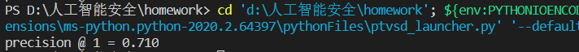

# 一、实验过程

1.定义训练轮数、batch_size，以及下载CIFAR-10数据的默认路径

```python
max_steps = 3000
batch_size = 128
data_dir = 'cifar-10-batches-py'
```

2.定义初始化weight函数

```python
def variable_with_weight_loss(shape, stddev, w1):
    var = tf.Variable(tf.truncated_normal(shape, stddev=stddev))
    if w1 is not None:
        weight_loss = tf.multiply(tf.nn.l2_loss(var), w1, name='weight_loss')
        tf.add_to_collection('losses', weight_loss)
    return var
```

3.使用cifar10_input.inputs函数生成测试数据

```python
images_test, labels_test = cifar10_input.inputs(eval_data=True,
                                               data_dir=data_dir,
                                               batch_size=batch_size)
```

4.创建输入数据的placeholder,包括特征和label

```
image_holder = tf.placeholder(tf.float32, [batch_size, 24, 24, 3])
label_holder = tf.placeholder(tf.int32, [batch_size])
```

5.创建conv1和conv2，fc1和fc2，创建logits，以上为整个网络的inference部分。

下列代码为创建conv1

```
weight1 = variable_with_weight_loss(shape=[5, 5, 3, 64], stddev=5e-2, w1=0.0)
kernel1 = tf.nn.conv2d(image_holder, weight1, [1, 1, 1, 1], padding='SAME')
bias1 = tf.Variable(tf.constant(0.0, shape=[64]))
conv1 = tf.nn.relu(tf.nn.bias_add(kernel1, bias1))
pool1 = tf.nn.max_pool(conv1, ksize=[1, 3, 3, 1], strides=[1, 2, 2, 1], padding='SAME')
norm1 = tf.nn.lrn(pool1, 4, bias=1.0, alpha=0.001/9.0, beta=0.75)
```

6.接下来编写计算CNN的loss的函数

```
def loss(logits, labels):
    labels = tf.cast(labels, tf.int64)
    cross_entropy = tf.nn.sparse_softmax_cross_entropy_with_logits(
        logits=logits, labels=labels, name='cross_entropy_per_example')
    cross_entropy_mean = tf.reduce_mean(cross_entropy, name='cross_entropy')
    tf.add_to_collection('losses', cross_entropy_mean)
    return tf.add_n(tf.get_collection('losses'), name='total_loss')
```

7.将logits节点和label_holder传入loss函数获得最终loss

8.开始模型的训练

```
for step in range(max_steps):
    start_time = time.time()
    image_batch, label_batch = sess.run([images_train, labels_train])
    _, loss_value = sess.run([train_op, loss],
                             feed_dict={image_holder: image_batch,
                                        label_holder: label_batch})
    duration = time.time() - start_time
 
    if step % 10 == 0:
        examples_per_sec = batch_size / duration
        sec_per_batch = float(duration)
 
        format_str = ('step %d, loss = %.2f (%.1f examples/sec; %.3f sec/batch)')
        print(format_str % (step, loss_value, examples_per_sec, sec_per_batch))
```

9.评测模型在测试集上准确率，并将准确率评测结果打印出来

```
num_examples = 10000
import math
num_iter = int(math.ceil(num_examples / batch_size))
true_count = 0
total_sample_count = num_iter * batch_size
step = 0
while step < num_iter:
    image_batch, label_batch = sess.run([images_test, labels_test])
    predictions = sess.run([top_k_op], feed_dict={image_holder: image_batch,
                                                  label_holder: label_batch})
    true_count += np.sum(predictions)
    step += 1
 
precision = true_count / total_sample_count
print('precision @ 1 = %.3f' % precision)
```

# 二、实验结果

调整程序的参数，当batch_size = 128时，在CIFAR-10数据集上，通过一个短时间小迭代次数的训练，可以达到约71%的准确率。



